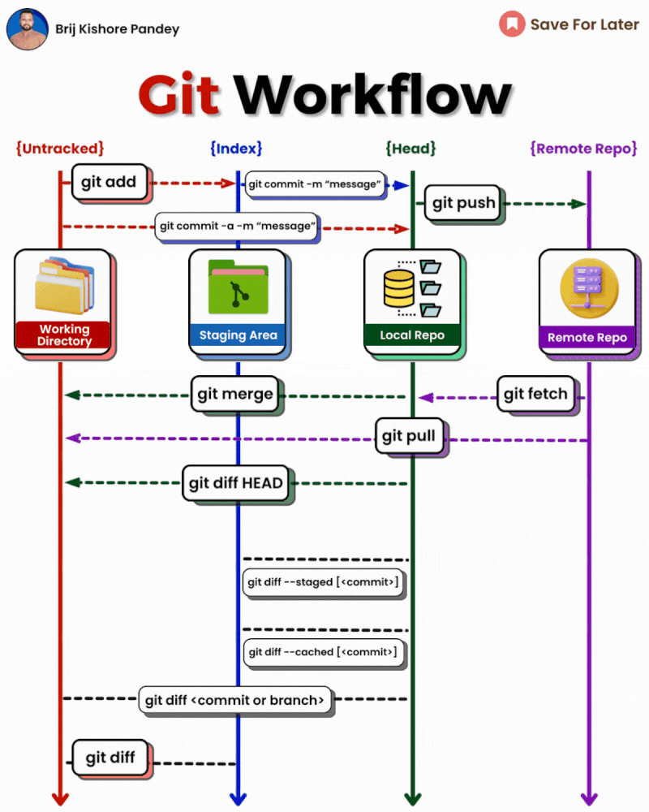

# Git Workflows Cheatseat



## Essential Git Commands: Getting Started

**Initialize git repositoty:**
```bash
git init
```

**Clone git repositoty:**
```bash
git clone [url]
```

## Working with Remotes

**List Remote git repositoty:**
```bash
git remote -v
```

**Add Remote to a git repositoty:**
```bash
git remote add [name] [url]
```

**Remove Remote from a Local git repositoty:**
```bash
git remote rm [name]
```

**Fetch changes from a Remote git repositoty:**
```bash
git fetch [remote]
```

**Pull changes from a Remote git repositoty:**
```bash
git pull [remote] [branch]
```

**Pushing Local changes to a Remote git repositoty:**
```bash
git push [remote] [branch]
```

## Branching and Merging

**List Branch of local git repository:**
```bash
git branch
```

**Create Branch on a local git repository:**
```bash
git branch [name]
```

**Switch Branch on a local git repository:**
```bash
git checkout -b [branch]
```

**Merge another Branch on a current branch of a local git repository:**
```bash
git merge [branch]
```

**Delete Branch on a local git repository:**
```bash
git branch -d [branch]
```

## Making changes to the local git repository

**Checking status:**
```bash
git status
```

**Adding changes/Stagging changed files:**
```bash
git add [files/directories]
```

**Committing changes with message:**
```bash
git commit -m "[message]"
```

**Amend Commit:**
```bash
git commit --amend [commit]
```

**Reset File Changes:**
```bash
git reset [file]
```

**Hard Reset Commit Changes:**
```bash
git reset --hard [commit]
```

## Reviewing History

**Checking git logs (with details of each commit):**
```bash
git log
```

**Checking git logs (oneline for each commit):**
```bash
git log --oneline
```

**Checking git logs (Graphical View):**
```bash
git log --graph
```

**Show changes between current state and commit:**
```bash
git show [commit]
```

**Difference between current branch and given branch:**
```bash
git diff [branch]
```

## Cleanup and Maintenance

**Stash changes temporarily:**
```bash
git stash
```

**Apply Stash changes temporarily:**
```bash
git stash pop
```

**Clean untracked files:**
```bash
git clean -f
```

## Advance and Miscelaneous

**Rebase the current branch with provided one:**
```bash
git rebase [branch]
```

**Cherry pick:**
```bash
git cherry-pick [commit]
```

**Tagging:**
```bash
𝚐𝚒𝚝 𝚝𝚊𝚐 [𝚗𝚊𝚖𝚎]
```

**Search Log:**
```bash
𝚐𝚒𝚝 𝚕𝚘𝚐 --𝚐𝚛𝚎𝚙="[𝚙𝚊𝚝𝚝𝚎𝚛𝚗]"
```

This list encapsulates many of the core Git commands but is not exhaustive.

Git's flexibility and depth mean there are commands and flags for various specialized scenarios, including configuration (`git config`), patching (`git apply`), and advanced merging options.

These commands form the backbone of most Git operations, facilitating version control and collaboration in software development projects.